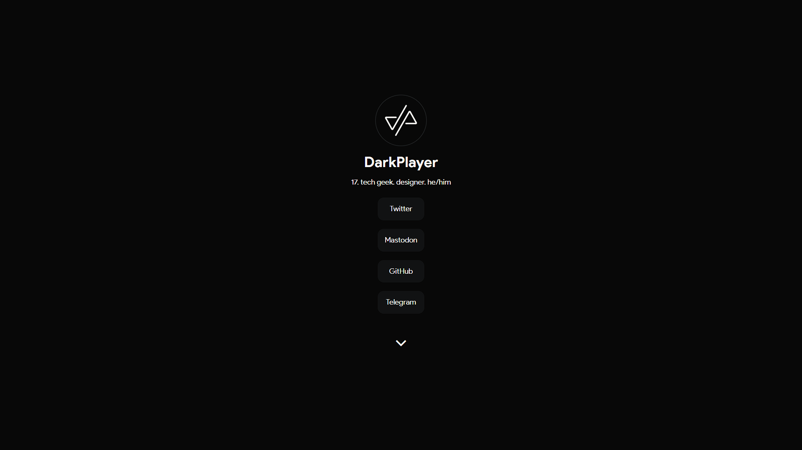

# DarkPlayerr.github.io

This is my own website. The code here is probably a mess, but it works (hopefully).

## Preview

A preview of this website is available on [darkplayer.me](https://darkplayer.me) or [DarkPlayerr.GitHub.io](https://github.com/DarkPlayerr/DarkPlayerr.github.io).

## Sources

For this website I used:
- [Normalize.css](https://necolas.github.io/normalize.css/) to normalize the CSS.
- [Flickity](https://github.com/metafizzy/flickity) for the photo carousel.
- Google's Product Sans font.
- [MNMLSM](https://github.com/MichaelBarney/LinkFree/tree/master/Templates/mnmlsm) for the heavily modified base.
